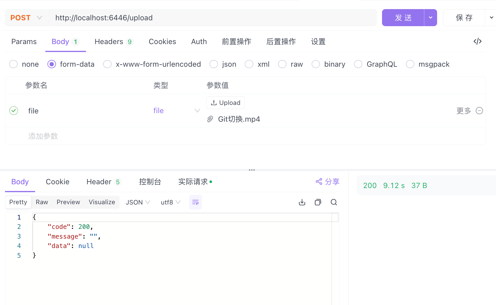
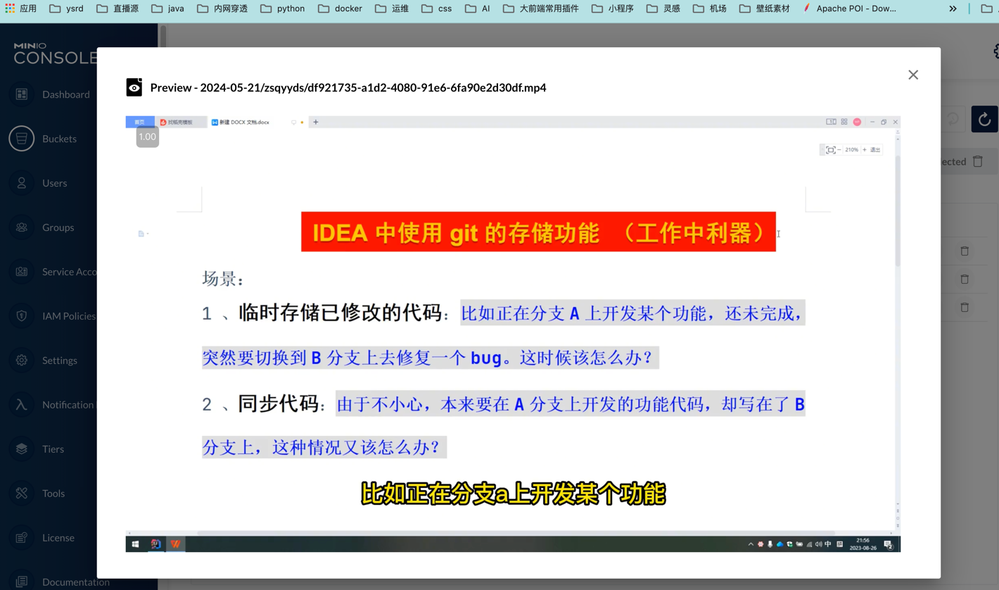

## winter-minio-spring-boot-starter

**********************************

提供AmazonS3Template，对外提供桶的增删改查以及权限设置，还提供了上传，分片上传等功能

## 1、打包

```
mvn clean install
```

## 2、项目中引入

```xml
 <dependency>
    <groupId>com.zsq</groupId>
    <artifactId>winter-minio-spring-boot-starter</artifactId>
    <version>0.0.1-SNAPSHOT</version>
</dependency>
```

## 3、配置

springboot项目配置文件application.properties：

```yaml
winter-aws:
  access-key: zsqyyds
  endpoint: :http://xxx:9886
  secret-key: zsqyyds123456789
  bucket: minio-springboot
  path-style-access: true
  region: ap-east-1
```

## 使用

定义实体类继承`Baseessage`类
```java
    @PostMapping("/upload")
public Result<?> uploadFiles(@RequestParam("file") MultipartFile file) throws IOException {
    String fileName = file.getOriginalFilename();
    Date currentDate = new Date();

    String suffix = fileName.substring(fileName.lastIndexOf(".") + 1);
    // 文件名称
    String key = StrUtil.format("{}/zsqyyds/{}.{}", DateUtil.format(currentDate, "YYYY-MM-dd"), IdUtil.randomUUID(), suffix);
    amazonS3Template.putObject(key,file,null);
    return Result.build(user,200,"");
}
```
消息发送方
```java
@RestController
@RequestMapping("/enhance")
@Slf4j
public class EnhanceProduceController {

    @Resource
    private RocketMQEnhanceTemplate rocketMQEnhanceTemplate;

    private static final String topic = "rocket_enhance";
    private static final String tag = "member";

    /**
     * 发送实体消息
     */
    @SystemLog(operationModule = "会员", operationType = OperationLogType.SEND, operationDesc = "测试rocketmq")
    @PostMapping("/member")
    public Result<?> member(@RequestBody MemberMessage message) {
        //{
        //    "userName": "张三",
        //        "age": 10,
        //        "money": 65545.45,
        //        "birthday": "2024-05-17"
        //}
        String key = IdUtil.randomUUID().toString();
        // 设置业务key
        message.setKey(key);
        // 设置消息来源，便于查询
        message.setSource("MEMBER");
        // 业务消息内容
        message.setRetryTimes(1);
        message.setSendTime(LocalDateTime.now());
        SendResult send = rocketMQEnhanceTemplate.send(topic, tag, message);
        return Result.ok(send);
    }
}
```

